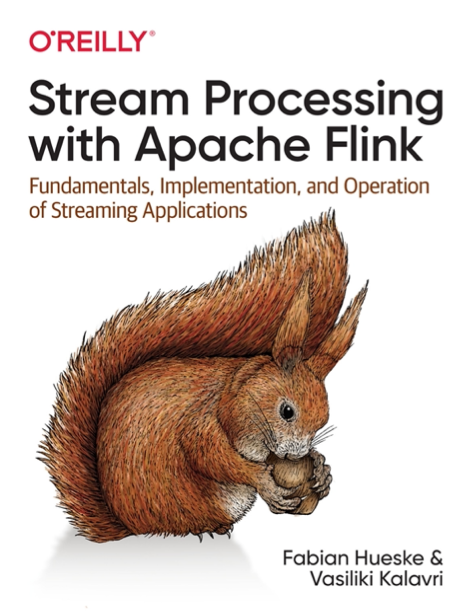

# Stream-Processing-With-Apache-Flink
Note of reading book - Stream Processing with Apache Flink

[Ch1. Introduction to Stateful Stream Processing](./ch1/ch1.md)

[Ch2. Stream Processing Fundamentals](./ch2/ch2.md)

[Ch3. The Architecture of Apache Flink](./ch3/ch3.md)

[Ch4. Setting Up a Development Environment for Apache Flink](./ch4/ch4.md)

[Ch5. The DataStream API](./ch5/ch5.md)

[Ch6. Time-Based and Window Operators](./ch6/ch6.md)

[Ch7. Stateful Operators and Applications](./ch7/ch7.md)

[Ch8. Reading from and Writing to External Systems](./ch8/ch8.md)

[Ch9. Setting Up Flink for Streaming Applications](./ch9/ch9.md)