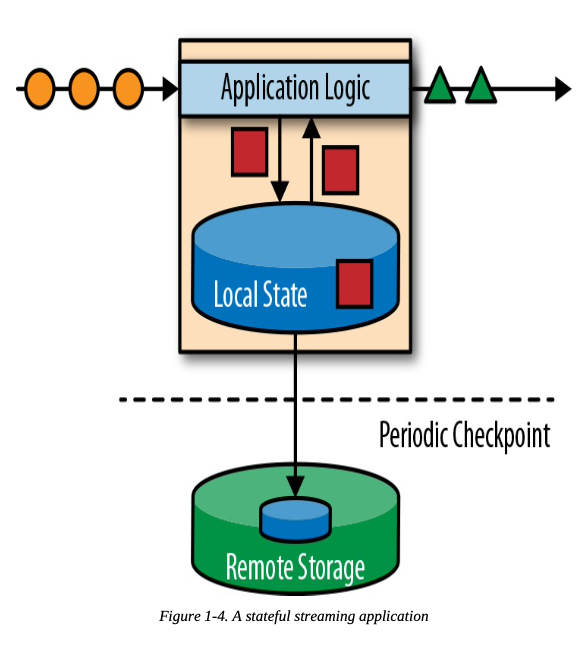
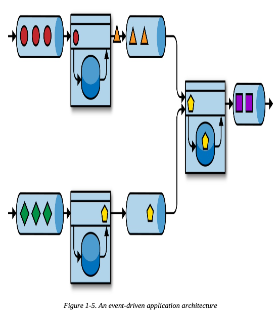
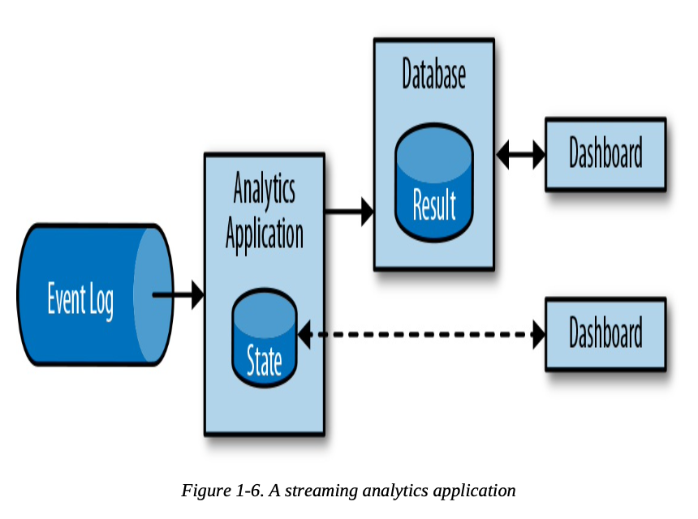
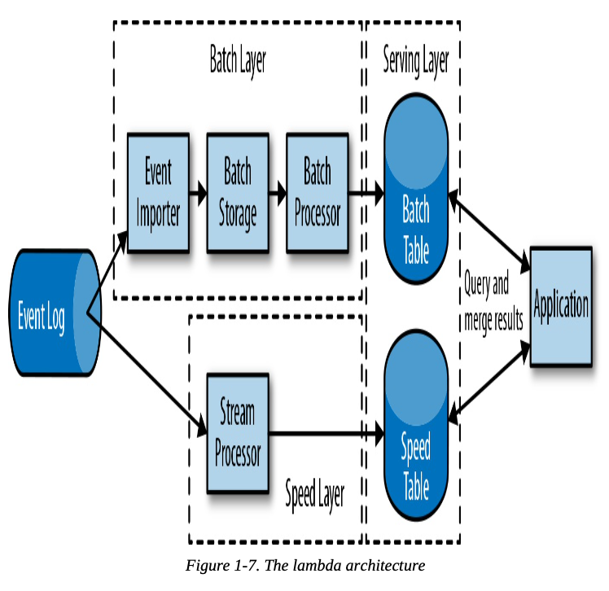

## Traditional Data Infrastructures

### Transactional Processing

- Cause problems when applications need to evolve or scale
  - Multiple application might work on the same data representation or share the same infrastructure, change the schema of a table or scaling a database system requires careful planning and lots of effort
  - Microservice can help resolve and make this be better

### Analytical Processing

- ETL: Extract Transform Load
  - Process used to copy data from transactional databases to data warehouse

## Stateful Stream Processing

- Apache Flink stores the application state locally in memory or in an embedded database
- Since Flink is a distributed system, the local state needs to be protected against failures to avoid data loss in case of application or machine failure. Flink guarantees this by periodically writing a consistent checkpoint of the application state to a remote and durable storage

- In case of a failure, Flink recovers a stateful streaming application by restoring its state from a previous checkpoint and resetting the read position on the event log.

### Event-Driven Applications

- Event-driven applications are stateful streaming applications that ingest event streams and process the events with application-specific business logic
- Event-driven applications are an evolution of microservices. They communicate via event logs instead of REST calls and hold application data as local state instead of writing it to and reading it from an external datastore, such as a relational database or key-value store.

- The event log decouples senders and receivers and provides asynchronous, nonblocking event transfer
- Each application can be stateful and can locally manage its own state without accessing external datastores
- Applications can also be individually operated and scaled
- Benefits compared to transactional applications or microservices:
  - Local state access provides very good performance compared to reading and writing queries against remote datastores
  - Scaling and fault tolerance are handled by the stream processor
  - Flink can reset the state of an application to a previous savepoint, making it possible to evolve or rescale an application without losing its state

### Data pipeline

- A traditional approach to synchronize data in different storage systems is periodic ETL jobs. However, they do not meet the latency requirements for many of today’s use cases
- An alternative is to use an event log to distribute updates
- Ingesting, transforming, and inserting data with low latency is another common use case for stateful stream processing applications. This type of application is called a data pipeline

### Streaming Analytics

- Instead of waiting to be periodically triggered, a streaming analytics application continuously ingests streams of events and updates its result by incorporating the latest events with low latency

- Traditional analytics pipelines consist of several individual components such as an ETL process, a storage system, and in the case of a Hadoop-based environment, a data processor and scheduler to trigger jobs or queries. In contrast, a stream processor that runs a stateful streaming application takes care of all these processing steps, including event ingestion, continuous computation including state maintenance, and updating the results
- Streaming analytics applications are commonly used for:
  - Monitoring the quality of cellphone networks
  - Analyzing user behavior in mobile applications
  - Ad-hoc analysis of live data in consumer technology

## A Bit of History

- The lambda architecture augments the traditional periodic batch processing architecture with a speed layer that is powered by a low-latency stream processor

- Few notable drawbacks:
  - Requires two semantically equivalent implementations of the application logic for two separate processing systems with different APIs
  - The results computed by the stream processor are only approximate
  - The lambda architecture is hard to set up and maintain

