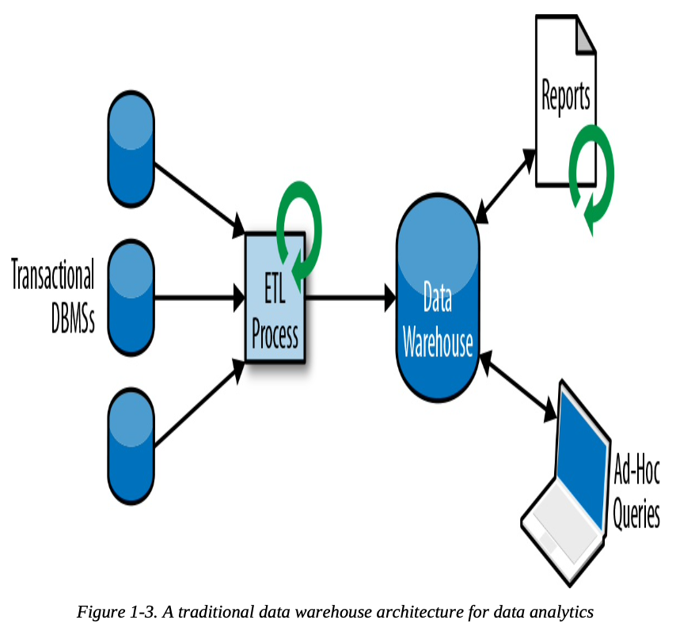

## Traditional Data Infrastructures

### Transactional Processing

- Cause problems when applications need to evolve or scale
  - Multiple application might work on the same data representation or share the same infrastructure, change the schema of a table or scaling a database system requires careful planning and lots of effort
  - Microservice can help resolve and make this be better

### Analytical Processing

- ETL: Extract Transform Load
  - Process used to copy data from transactional databases to data warehouse

## Stateful Stream Processing
