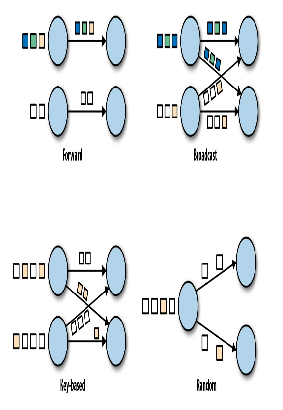

## Introduction to Dataflow Programming

- **Data Parallelism**: You can partition your input data and have tasks of the same operation execute on the data subsets in parallel
- **Task Parallelism**: You can have tasks from different operators performing computations on the same or different data in parallel

- **Data Exchange Strategies**:
  - **Forword strategy**: Sends data from a task to a receiving task
  - **Broadcast strategy**: Sends every data item to all parallel tasks of an operator
  - **Key-based strategy**: Partitions data by a key attribute and guarantees that data items having the same key will be processed by the same task
  - **Random strategy**: uniformly distributes data items to operator tasks in order to evenly distribute the load across computing tasks.

