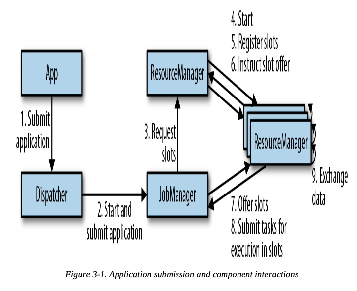
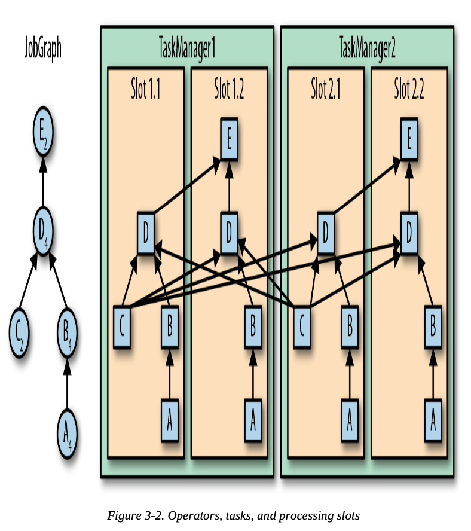
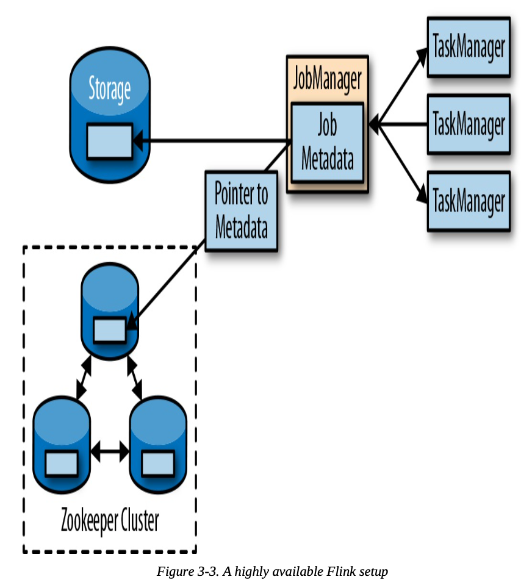
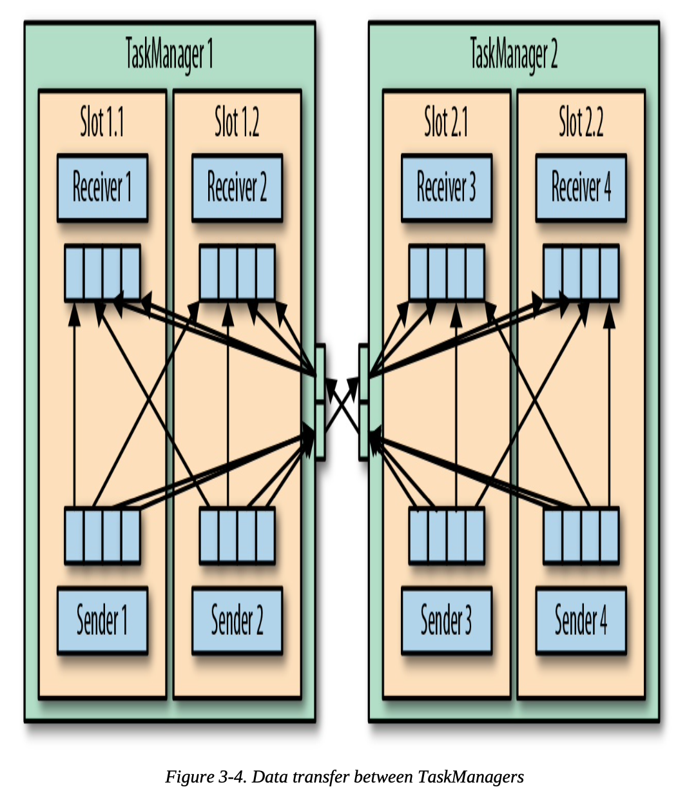
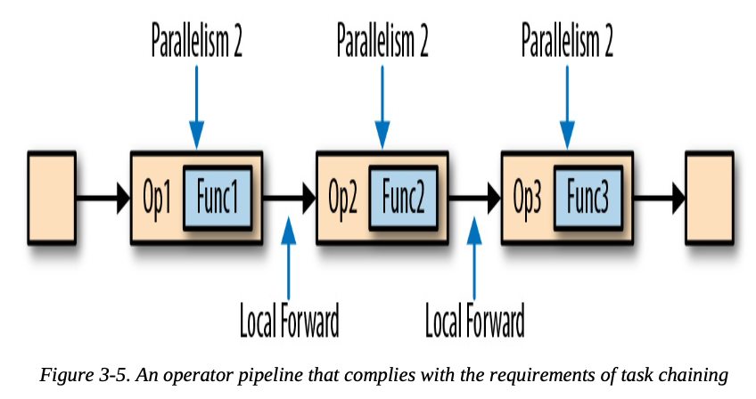
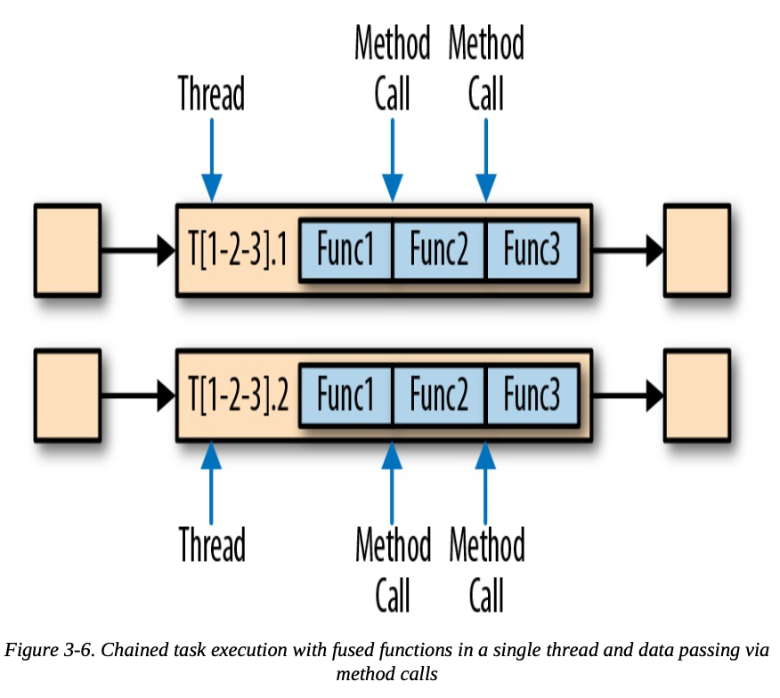
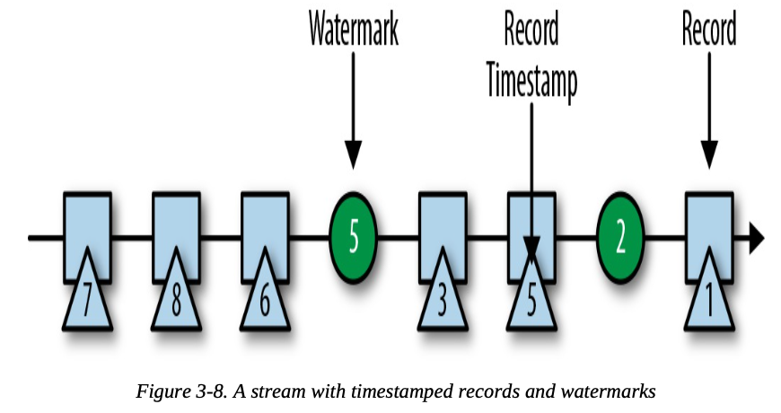

## The Architecture of Apache Flink

### System Architecture

- Common challenges that distributed systems need to address:
  - Allocation and management of compute resources in a cluster
  - Coordination, Durable and highly available data storage
  - Failure recovery
- Flink is well integrated with cluster resource managers, such as Apache Mesos, YARN, and Kubernetes, but can also be configured to run as a standalone cluster
- Flink does not provide durable, distributed storage. Instead, it takes advantage of distributed filesystems like HDFS or object stores such as S3
- For leader election in highly available setups, Flink depends on Apache ZooKeeper

#### Components of a Flink Setup

- A Flink setup consists of four different components that work together to execute streaming applications
  - **JobManager**
    - Master process that controls the execution of a single application
    - Works for JobManager
      - Receieves an application for execution (applicaiton consists of JobGraph, JAR file, etc)
      - Converts the JobGraph into a physical dataflow graph (called the ExecutionGraph), which consists of tasks that can be executed in parallel
      - Reuqests the necessary resources (TaskManager slots) from ResourceManager
      - Distributes the tasks of the ExecutionGraph to the TaskManagers that execute them
      - During execution, responsible for all actions that require a central coordination
  - **ResourceManager**
    - Responsible for managing TaskManager slots
    - If the ResourceManager does not have enough slots to fulfill the JobManager’s request, the ResourceManager can talk to a resource provider to provision containers in which TaskManager processes are started
    - Also takes care of terminating idle TaskManagers to free compute resources
  - **TaskManager**
    - Worker processes of Flink
    - Each TaskManager provides a certain number of slots. The number of slots limits the number of tasks a TaskManager can execute
    - After it has been started, a TaskManager registers its slots to the ResourceManager
    - When instructed by the ResourceManager, the TaskManager offers one or more of its slots to a JobManager
    - The JobManager can then assign tasks to the slots to execute them
    - During execution, a TaskManager exchanges data with other TaskManagers that run tasks of the same application
  - **Dispatcher**
    - Serve as an HTTP entry point to clusters that are behind a firewall
    - Runs across job executions and provides a REST interface to submit applications for execution
    - Once an application is submitted for execution, it starts a JobManager and hands the application over
    - Also runs a web dashboard to provide information about job executions
    - Dispatcher might not be required in some scenarios

#### Application Deployment

- **Framwork style**
  - Flink application are packaged into a JAR file and submitted by a client to a running service
  - If application was submitted to JobManager, it immediately starts to execute the application
  - If application was submitted to Dispatcher or YARN ResourceManager, it will spin up a JobManager and hand over the application
  - Traditional approach of submitting an application (or query) via a client to a running service
- **Libaray style**
  - Flink application is bundled in an application specific container image
  - When a container is started from the image, it automatically launches the ResourceManager and JobManager and submits the bundled job for execution
  - Common for microservices architectures

#### Task Execution

- A TaskManager can execute several tasks at the same time
- These tasks can be subtasks of the same operator (data parallelism), a different operator (task parallelism), or even from a different application (job parallelism)
- A processing slot can execute one slice of an application—one parallel task of each operator of the application

- One the Figure above:
  - Left-hand side is the JobGraph (nonparallel representation of an application)
- TaskManager can efficiently exchange data within the the same process and without accessing the network
- A TaskManager executes its tasks multithreaded in the same JVM process
  - Threads are more lightweight than separate processes and have lower communication costs but do not strictly isolate tasks from each other
  - A single misbehaving task can kill a whole TaskManager process and all tasks that run on it
  - By configuring only a single slot per TaskManager, you can isolate applications across TaskManagers

#### Highly Available Setup

##### TaskManager Failures

- If one of the TaskManagers fails, the JobManager will ask the ResourceManager to provide more processing slots
- The application’s restart strategy determines how often the JobManager restarts the application and how long it waits between restart attempts

##### JobManager Failures

- Flink supports a high-availability mode that migrates the responsibility and metadata for a job to another JobManager in case the original JobManager disappears
- Flink’s high-availability mode is based on Apache ZooKeeper
- When operating in high-availability mode, the JobManager writes the JobGraph and all required metadata, such as the application’s JAR file, into a remote persistent storage system
- In addition, the JobManager writes a pointer to the storage location into ZooKeeper’s datastore

- When a JobManager fails, all tasks that belong to its application are automatically cancelled. A new JobManager that taks over the work and perform steps:
  1. It requests the storage locations from ZooKeeper to fetch the JobGraph, the JAR file, and the state handles of the last checkpoint of the application from the remote storage
  2. It requests processing slots from the ResourceManager to continue executing the application
  3. It restarts the application and resets the state of all its tasks to the last completed checkpoint
- Flink does not provide tooling to restart failed processes when running in a standalone cluster
  - It can be useful to run standby JobManagers and TaskManagers that can take over the work of failed processes

### Data Transfer in Flink

- The network component of a TaskManager collects records in buffers before they are shipped, i.e., records are not shipped one by one but batched into buffers
- Shipping records in buffers does imply that Flink’s processing model is based on microbatches
- Each TaskManager has a pool of network buffers (by default 32 KB in size) to send and receive datas
- If the sender and receiver tasks run in separate TaskManager processes, they communicate via the network stack of the operating system

- Each of the 4 sender tasks needs at least 4 network buffers to send data to each of the receiver tasks and each receiver task requires at least 4 buffers to receive data
- Buffers that need to be sent to the other TaskManager are multiplexed over the same network connection
- With a shuffle or broadcast connection, each sending task needs a buffer for each receiving task; the number of required buffers is quadratic to the number of tasks of the involved operators

#### Credit-Based Flow Control

- A receiving task grants some credit to a sending task, the number of network buffers that are reserved to receive its data
- Once a sender receives a credit notification, it ships as many buffers as it was granted and the size of its backlog
- The receiver processes the shipped data with the reserved buffers and uses the sender’s backlog size to prioritize the next credit grants for all its connected senders
- Credit-based flow control reduces latency because senders can ship data as soon as the receiver has enough resources to accept it
- it is an effective mechanism to distribute network resources in the case of skewed data distributions because credit is granted based on the size of the senders’ backlog

#### Task Chaining

- In order to satisfy the requirements for task chaining, two or more operators must be configured with the same parallelism and connected by local forward channels

- How the pipeline is executed with task chaining:
  - The functions of the operators are fused into a single task that is executed by a single thread
  - Records that are produced by a function are separately handed over to the next function with a simple method call
  - No serialization and communication costs for passing records

- Execute a pipeline without chaining:

- Task chaining is enabled by default in Flink

### Event-Time Processing

#### Timestamps

- All records that are processed by a Flink event-time streaming application must be accompanied by a timestamp
- When Flink processes a data stream in event-time mode, it evaluates time-based operators based on the timestamps of records
- Flink encodes timestamps as 16-byte Long values and attaches them as metadata to records

#### Watermarks

- In addition to record timestamps, a Flink event-time application must also provide watermarks
- Time-based operators use this time to trigger computations and make progress
- Watermarks flow in a stream of regular records with annotated timestamps

- 2 basic properties of watermarks:
  1. They must be monotonically increasing to ensure the event-time clocks of tasks are progressing and not going backward
  2. They are related to record timestamps. A watermark with a timestamp `T` indicates that all subsequent records should have timestamps > `T`

- **Late records**: a record that violates the watermark property and has smaller timestamps than a previously received watermark
- Watermarks allow an application to control result completeness and latency, it comes with trade-off
  - Very tight watermark result in low processing latency but poor result completeness
  - Very conservative watermarks increase processing latency but improve result completeness

#### Watermark Propagation and Event Time

- Flink implements watermarks as special records that are received and emitted by operator tasks
- When a task receives a watermark, the following actions take place
  1. The task updates its internal event-time clock based on the watermark’s timestamp
  2. The task’s time service identifies all timers with a time smaller than the updated event time. For each expired timer, the task invokes a callback function that can perform a computation and emit records
  3. The task emits a watermark with the updated event time
- When tasks receives a watermark from a input partition:
  1. It updates the respective partition watermark to be the maximum of the received value and the current value
  2. Updates its event-time clock to be the minimum of all partition watermarks
  3. If the event-time clock advances, the task processes all triggered timers and finally broadcasts its new event time to all downstream tasks by emitting a corresponding watermark to all connected output partitions
- This algorithm is relies on the fact that all partitions continuously provide increasing watermarks
- If any partition have problem, the event-time clock of a task will not advance and the timers of the task will not trigger
  - A similar effect appears for operators with two input streams whose watermarks significantly diverge, the faster stream are buffered in state until the event-time clock allows processing them

