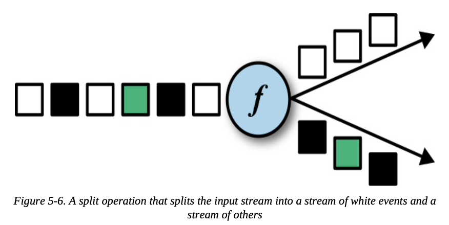

## The DataStream API (v1.7)

### Hello, Flink!

- To structure a typical Flink streaming application:
  1. Set up the execution environment
  2. Read one or more streams from data sources
  3. Apply streaming transformations to implement the application logic
  4. Optionally output the result to one or more data sinks
  5. Execute the program

#### Set Up the Execution Environment

- The execution environment determines whether the program is running on a local machine or on a cluster
- In the DataStream API, the execution environment of an application is represented by the `StreamExecutionEnvironment`
  - `StreamExecutionEnvironment.getExecutionEnvironment()` returns a local or remote environment
  - It is also possible to explicitly create local or remote execution environments:
    - `StreamExecutionEnvironment.createLocalEnvironment()` for local
    - `StreamExecutionEnvironment.createRemoteEnvironment()` for remote
  - The execution environment offers more configuration options, such as setting the program parallelism and enabling fault tolerance
- `env.setStreamTimeCharacteristic(TimeCharacteristic.EventTime)` to instruct our program to interpret time semantics using event time

#### Read an Input Stream

- Data streams can be ingested from sources such as message queues or files, or also be generated on the fly
- We create an initial DataStream of type SensorReading:
  ```java
  // ingest sensor stream
  // SensorReading contains the sensor ID, a timestamp denoting when the measurement was taken, and the measured temperature
  DataStream<SensorReading> sensorData = env
      // SensorSource generates random temperature readings
      .addSource(new SensorSource())
      // assign timestamps and watermarks which are required for event time
      .assignTimestampsAndWatermarks(new SensorTimeAssigner());
  ```

#### Apply Transformations

- The logic of an application is defined by chaining transformations

```java
DataStream<SensorReading> avgTemp = sensorData
    // convert Fahrenheit to Celsius using and inlined map function
    .map(r -> new SensorReading(r.id, r.timestamp, (r.temperature - 32) * (5.0 / 9.0)))
    // organize stream by sensor
    .keyBy(r -> r.id)
    // group readings in 1 second windows
    .timeWindow(Time.seconds(1))
    // compute average temperature using a user-defined function
    .apply(new TemperatureAverager());
```

#### Output the Result

- Flink provides a well-maintained collection of stream sinks that can be used to write data to different systems
- It is also possible to implement your own streaming sinks
- There are also applications that do not emit results but keep them internally to serve them via Flink’s queryable state feature

#### Execute

- After completely defined, application can be executed by calling `StreamExecutionEnvironment.execute()`
- Flink programs are executed lazily, only when `execute()` is called does the system trigger the execution of the program
- The constructed plan is translated into a JobGraph and submitted to a JobManager for execution

### Transformations

- Transformations of the DataStream API in 4 categories
  1. Basic transformations are transformations on individual events
  2. KeyedStream transformations are transformations that are applied to events in the context of a key
  3. Multistream transformations merge multiplestreams in to one stream or split one stream into multiple streams
  4. Distribution transformations reorganize stream events

#### Basic Transformations

- Basic transformations process individual events, meaning that each output record was produced from a single input record, eg.
  - Simple value conversions
  - Splitting of records
  - Filtering of records

##### Map

- Specified by calling the `DataStream.map()` method and produces a new `DataStream`
- It passes each incoming event to a user-defined mapper that returns exactly one output event, possibly of a different type


##### Filter

- The filter transformation drops or forwards events of a stream by evaluating a boolean condition on each input event
  - A return value of true preserves the input event and forwards it to the output
  - False results in dropping the event
- Specified by calling the `DataStream.filter()` method and produces a new `DataStream` of the same type as the input DataStream


##### FlatMap

- Similar to map, but it can produce zero, one, or more output events for each incoming event
- The flatMap transformation is a generalization of filter and map and can be used to implement both those operations


#### KeyedStream Transformations

- All events with the same key access the same state and thus can be processed together

##### KeyBy

- The **keyBy** transformation converts a DataStream into a KeyedStream by specifying a key
  - All events with the same key are processed by the same task of the subsequent operator
- Events with different keys can be processed by the same task, but the keyed state of a task’s function is always accessed in the scope of the current event’s key


- The `keyBy()` method receives an argument that specifies the key (or keys) to group by and returns a KeyedStream

##### Rolling Aggregations

- Rolling aggregation transformations are applied on a KeyedStream and produce a DataStream of aggregates, such as sum, minimum, and maximum
- For each incoming event, the operator updates the corresponding aggregate value and emits an event with the updated value
- DataStream API provides the following rolling aggregation methods:
  - sum()
  - min()
  - max()
  - minBy()
  - maxBy()
- It is not possible to combine multiple rolling aggregation methods—only a single rolling aggregate can be computed at a time
- The rolling aggregate operator keeps a state for every key that is processed. Since this state is never cleaned up, you should only apply a rolling aggregations operator on a stream with a bounded key domain

##### Reduce

- The reduce transformation is a generalization of the rolling aggregation
- A reduce transformation does not change the type of the stream
- Similar as rolling aggregations, only use rolling reduce on bounded key domains

#### Multistream Transformations

- Process multiple input streams or emit multiple output streams

##### Union

- `DataStream.union()` method merges two or more DataStreams of the same type and produces a new DataStream of the same type
- The events are merged in a FIFO fashion—the operator does not produce a specific order of events
- The union operator does not perform duplication elimination. Every input event is emitted to the next operator


##### Connect, CoMap, And CoFlatMap

- `DataStream.connect()` method receives a DataStream and returns a **ConnectedStreams** object, which represents the two connected streams
- The ConnectedStreams object provides `map()` and `flatMap()` methods that expect a **CoMapFunction** and **CoFlatMapFunction** as argument respectively
```scala
// IN1: the type of the first input stream
// IN2: the type of the second input stream
// OUT: the type of the output elements
CoMapFunction[IN1, IN2, OUT]
    > map1(IN1): OUT
    > map2(IN2): OUT
// IN1: the type of the first input stream
// IN2: the type of the second input stream
// OUT: the type of the output elements
CoFlatMapFunction[IN1, IN2, OUT]
    > flatMap1(IN1, Collector[OUT]): Unit
    > flatMap2(IN2, Collector[OUT]): Unit
```

- It is not possible to control the order in which the methods of a CoMapFunction or CoFlatMapFunction are called. Instead, a method is called as soon as an event has arrived via the corresponding input
- In order to achieve deterministic transformations, on ConnectedStreams, `connect()` can be combined with `keyBy()` or `broadcast()`

##### Split And Select

- Split is the inverse transformation to the union transformation
- It divides an input stream into two or more output streams of the same type as the input stream
- Split can also be used to filter or replicate events



- `DataStream.split()` method receives an `OutputSelector` that defines how stream elements are assigned to named outputs
- `OutputSelector` defines the `select()` method that is called for each input event and returns a `java.lang.Iterable[String]`
  - The String values that are returned for a record specify the output streams to which the record is routed
- `DataStream.split()` method returns a `SplitStream`, which provides a `select()` method to select one or more streams from the `SplitStream` by specifying the output names
- One restriction of the split transformation is that all outgoing streams are of the same type as the input type


#### Distribution Transformations

- `DataStream` methods that enable users to control partitioning strategies or define their own

- **Random**:
  - Distributes records randomly according to a uniform distribution to the parallel tasks of the following operator
  - Implemented by the `DataStream.shuffle()` method
- **Round-Robin**:
  - Records are evenly distributed to successor tasks in a round-robin fashion
  - Implemented by the `rebalance()` method, and will create communication channels between all sending tasks to all receiving tasks
- **Rescale**:
  - Also distributes events in a round-robin fashion, but only to a subset of successor tasks
  - Implemented by the `rescale()` method, will only create channels from each task to some of the tasks of the downstream operator
  - Offers a way to perform a lightweight load rebalance when the number of sender and receiver tasks is not the same
- **Broadcast**:
  - Implemented by `broadcast()` method, replicaates the input data stream so that all events are sent to all parallel tasks of the downstream operator
- **Global**:
  - Sends all events of the input data stream to the first parallel task of the downstream operator
  - Implemented by `global()` but must be used with care
- **Custom**:
  - You can define your own partitioning strategies by using the `partitionCustom()` method
    - The method receives a `Partitioner` object that implements the partitioning logic
  
#### Setting the Parallelism

