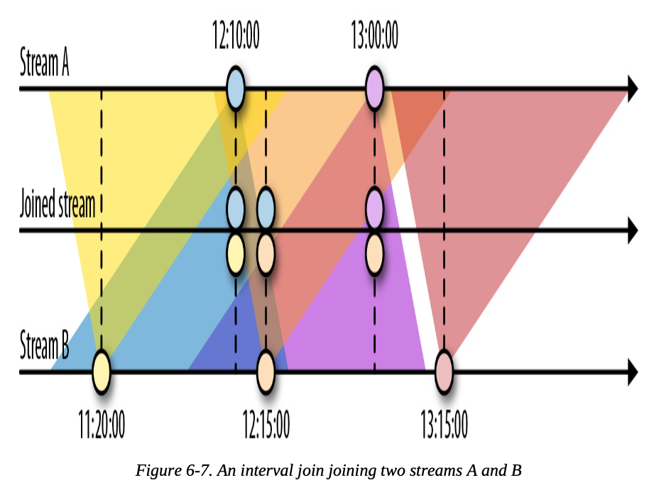
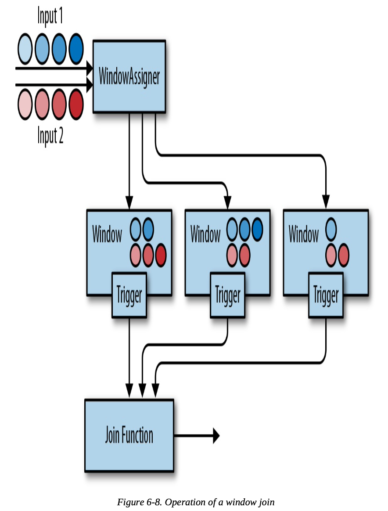

## Time-Based and Window Operators

### Configuring Time Characteristics

- In the DataStream API, you can use the time characteristic to tell Flink how to define time when you are creating windows
- The time characteristic is a property of the `StreamExecutionEnvironment` and it takes the following values:
  - **ProcessingTime**
    - Operators determine the current time of the data stream according to the system clock of the machine where they are being executed
    - In general, using processing time for window operations results in nondeterministic results
    - This setting offers very low latency because processing tasks do not have to wait for watermarks to advance the event time
  - **EventTime**
    - Operators determine the current time by using information from the data itself
    - An event-time window triggers when the watermarks declare that all timestamps for a certain time interval have been received
    - Event-time windows compute deterministic results even when events arrive out of order
  - **IngestionTime**
    - It is a hybrid of EventTime and ProcessingTime
    - The ingestion time of an event is the time it entered the stream processor

#### Assigning Timestamps and Generating Watermarks

- Application need to provide 2 important info for Flink operate in event time:
  - Each event must be associated with a timestamp that typically indicates when the event actually happened
  - Event-time stream also need to carry watermarks from which operators infer the current event time
- A watermark tells operators that no more events with a timestamp less than or equal to the watermark are expected
- If a timestamp assigner is used, any existing timestamps and watermarks will be overwritten
- `TimestampAssigner` interface extract timestamps from elements after they have been ingested into the streaming application
- To ensure that event-time operations behave as expected, the assigner should be called before any event-time dependent transformation
- Timestamp assigners are called on a stream of elements and produce a new stream of timestamped elements and watermarks
- Timestamp assigners do not change the data type of a DataStream

##### Assigner With Periodic Watermarks

- Instruct the system to emit watermarks and advance the event time in fixed intervals of machine time
- Default interval is set to two hundred milliseconds, but it can be configured using the `ExecutionConfig.setAutoWatermarkInterval()`
- If your input elements have timestamps that are monotonically increasing, you can use the shortcut method `assignAscendingTimeStamps`
- When you know the maximum lateness that you will encounter in the input stream, can use `BoundedOutOfOrdernessTimeStampExtractor`

##### Assigner With Punctuated Watermarks

- Flink provides the `AssignerWithPunctuatedWatermarks` interface for watermarks can be defined based on some other property of the input elements
  - It defines the `checkAndGetNextWatermark()` method, which is called for each event right after `extractTimestamp()`
  - `checkAndGetNextWatermark()` can decide to generate a new watermark or not
  - A new watermark is emitted if the method returns a nonnull watermark that is larger than the latest emitted watermark

#### Watermarks, Latency, and Completeness

- Watermarks are used to balance latency and result completeness
- Watermarks control how long to wait for data to arrive before performing a computation
- The reality is that we can never have perfect watermarks because that would mean we are always certain there are no delayed records
- The latency/completeness tradeoff is a fundamental characteristic of stream processing applications

### Process Functions

- Process functions can access record timestamps and watermarks and register timers that trigger at a specific time in the future
- Process functions are commonly used to build event-driven applications and to implement custom logic for which predefined windows and transformations might not be suitable
- Flink provides eight different process functions:
  - **ProcessFunction**
  - **KeyedProcessFunction**
  - **CoProcessFunction**
  - **ProcessJoinFunction**
  - **BroadcastProcessFunction**
  - **KeyedBroadcastProcessFunction**
  - **ProcessWindowFunction**
  - **ProcessAllWindowFunction**
- All process functions implement the RichFunction interface and hence offer `open()`, `close()`, and `getRuntimeContext()` methods
- **KeyedProcessFunction** provides the following 2 methods:
  - `processElement()`
    - Called for each record of the stream
  - `onTimer()`
    - Callback function that is invoked when a previously registered timer triggers

#### TimerService and Timers

- The TimerService of the Context and OnTimerContext objects offers the following methods
  - `currentProcessingTime()`: returns the current processing time
  - `currentWatermark()`: returns the timestamp of the current watermark
  - `registerProcessingTimeTimer()`: registers a processing time timer for the current key
  - `registerEventTimeTimer()`: registers an event-time timer for the current key. The timer will fire when the watermark is updated to a timestamp that is equal to or larger than the timer’s timestamp
  - `deleteProcessingTimeTimer()`: deletes a processing-time timer that was previously registered for the current key
  - `deleteEventTimeTimer()`: deletes an event-time timer that was previously registered for the current key
- When a timer fires, the onTimer() callback function is called
- Timers can only be registered on keyed streams

#### Emitting to Side Outputs

- Side outputs are a feature of process functions to emit multiple streams from a function with possibly different types
- Process functions can emit a record to one or more side outputs via the Context object

#### CoProcessFunction

- A CoProcessFunction offers a transformation method for each input

### Window Operators

- Windows enable transformations such as aggregations on bounded intervals of an unbounded stream

#### Defining Window Operators

- Window operators on keyed windows are evaluated in parallel, and nonkeyed windows are processed in a single thread
- To create a window operator, you need to specify two window components:
  - A **window assigner** that determines how the elements of the input stream are grouped into windows. It produces a WindowedStream (or AllWindowedStream if applied on a nonkeyed DataStream)
  - A **window function** that is applied on a WindowedStream (or AllWindowedStream) and processes the elements that are assigned to a window


#### Built-in Window Assigners

- Time-based window assigners assign an element based on its event-time timestamp or the current processing time to windows
- Time windows have a start and an end timestamp
- All built-in window assigners provide a default trigger that triggers the evaluation of a window once the (processing or event) time passes the end of the window
- It is important to note that a window is created when the first element is assigned to it. Flink will never evaluate empty windows
- Flink’s built-in window assigners create windows of type **TimeWindow**
  - This window type essentially represents a time interval between the two timestamps, where start is inclusive and end is exclusive
  - It exposes methods to retrieve the window boundaries, to check whether windows intersect, and to merge overlapping windows

##### Tumbling Windows

- A tumbling window assigner places elements into nonoverlapping, fixed-size windows


- The DataStream API provide 2 tumbling window assigner
  - `TumblingEventTimeWindows`
  - `TumblingProcessingTimeWindows`

- A tumbling window assigner receives one parameter, the window size in time units; this can bespecified using the `of(Time size)` method of the assigner

##### Sliding Windows

- The sliding window assigner assigns elements to fixed-sized windows that are shifted by a specified slide interval


- For a sliding window, you have to specify a window size and a slide interval that defines how frequently a new window is started
  - When the slide interval is smaller than the window size, the windows overlap and elements can be assigned to more than one window
  - If the slide is larger than the window size, some elements might not be assigned to any window and hence may be dropped

##### Session Windows

- A session window assigner places elements into nonoverlapping windows of activity of varying size
- The boundaries of session windows are defined by gaps of inactivity, time intervals in which no record is received


#### Applying Functions on Windows

- Window functions define the computation that is performed on the element of a window
- There are 2 types of functions that can be applied on a window:
  - **Incremental aggregation functions**:
    - Hold and update a single value as window state, and eventually emit the aggregated value as a result
    - eg. `ReduceFunction`, `AggregateFunction`
  - **Full window functions**:
    - Collect all elements of a window and iterate over the list of all collected elements when they are evaluated
    - `ProcessWindowFunction`

##### Reduce Function

- When a new element is received, the `ReduceFunction` is called with the new element and the current value that is read from the window’s state
- The window’s state is replaced by the ReduceFunction’s result
- The input and output type must be the same

##### Aggregate Function

- Similar to `ReduceFunction`, but `AggregateFunction` is much more flexible
- Interface of the `AggregateFunction`:
  ```scala
  public interface AggregateFunction<IN, ACC, OUT> extends Function, Serializable {
    // create a new accumulator to start a new aggregate.
    ACC createAccumulator();

    // add an input element to the accumulator and return the accumulator.
    ACC add(IN value, ACC accumulator);

    // compute the result from the accumulator and return it.
    OUT getResult(ACC accumulator);

    // merge two accumulators and return the result.
    ACC merge(ACC a, ACC b);
  }
  ```
- In contrast to the `ReduceFunction`, the intermediate data type and the output type do not depend on the input type

##### Process Window Function

- Perform arbitrary computations on the contents of a window
- Interface of the `ProcessWindowFunction`:
  ```scala
  public abstract class ProcessWindowFunction<IN, OUT, KEY, W extends Window> extends AbstractRichFunction {
    // Evaluates the window
    void process(KEY key, Context ctx, Iterable<IN> vals, Collector<OUT> out) throws Exception;
    // Deletes any custom per-window state when the window is purged
    public void clear(Context ctx) throws Exception {}
    // The context holding window metadata
    public abstract class Context implements Serializable {
      // Returns the metadata of the window
      public abstract W window();
      // Returns the current processing time
      public abstract long currentProcessingTime();
      // Returns the current event-time watermark
      public abstract long currentWatermark();
      // State accessor for per-window state
      public abstract KeyedStateStore windowState();
      // State accessor for per-key global state
      public abstract KeyedStateStore globalState();
      // Emits a record to the side output identified by the OutputTag.
      public abstract <X> void output(OutputTag<X> outputTag, X value);
    }
  }
  ```

##### Incremental Aggregation And Process Window Function

- If you have incremental aggregation logic but also need access to window metadata, you can combine a ReduceFunction or AggregateFunction, which perform incremental aggregation, with a ProcessWindowFunction, which provides access to more functionality
- eg.
  ```scala
  input
    .keyBy(...)
    .timeWindow(...)
    .reduce(
      incrAggregator: ReduceFunction[IN],
      function: ProcessWindowFunction[IN, OUT, K, W])

  input
    .keyBy(...)
    .timeWindow(...)
    .aggregate(
      incrAggregator: AggregateFunction[IN, ACC, V],
      windowFunction: ProcessWindowFunction[V, OUT, K, W])
  ```

#### Customizing Window Operators

- The DataStream API exposes interfaces and methods to define custom window operators by allowing you to implement your own assigners, triggers, and evictors
  - assigners -> triggers -> evictor
```scala
stream
  .keyBy(...)
  .window(...)                   // specify the window assigner
  [.trigger(...)] trigger        // optional: specify the trigger
  [.evictor(...)] evictor        // optional: specify the evictor
  .reduce/aggregate/process(...) // specify the window function
```

##### Window Lifecycle

- A window is created when the WindowAssigner assigns the first element to it
- A window consists of different pieces of state as follows:
  - **Window Content**:
    - Elements that have been assigned to the window or the result of the incremental aggregation
  - **Window Object**:
    - The window operator groups elements based on the returned objects
    - A window object holds the information used to distinguish windows from each other
    - Each window object has an end timestamp that defines the point in time after which the window and its state can be deleted
  - **Timers of a trigger**:
    - A trigger can register timers to be called back at certain points in time
  - **Custom-defined state in a trigger**:
    - A trigger can define and use custom, per-window and per-key state
    - This state is completely controlled by the trigger and not maintained by the window operator
    - Trigger must clear all of its state in the Trigger.clear() method to prevent leaking state
- The window operator deletes a window when the end time of the window, defined by the end timestamp of the window object, is reached

##### Window Assigners

- The WindowAssigner determines for each arriving element to which windows it is assigned
- In addition to the `WindowAssigner` interface there is also the `MergingWindowAssigner` interface that extends WindowAssigner
  - The `MergingWindowAssigner` is used for window operators that need to merge existing windows
  - When merging windows, you need to ensure that the state of all merging windows and their triggers is also appropriately merged

##### Triggers

- Triggers define when a window is evaluated and its results are emitted
- The default triggers of the previously discussed time windows fire when the processing time or the watermark exceed the timestamp of the window’s end boundary
- Every time a trigger is called it produces a **TriggerResult** that determines what should happen to the window, **TriggerResult** can take one of the following values:
  - **Continue**: No action is taken
  - **Fire**:
    - If the window operator has a ProcessWindowFunction, the function is called and the result is emitted
    - If the window only has an incremetal aggregation function (ReduceFunction or AggregateFunction) the current aggregation result is emitted
  - **Purge**:
    - The content of the window is completely discarded and the window including all metadata is removed
    - `ProcessWindowFunction.clear()` method is invoked to clean up all custom per-window state
  - **Fire_AND_PURGE**:
    - Evaluates the window first (FIRE)
    - Subsequently removes all state and metadata (PURGE)
- There are two aspects of triggers that require special care: cleaning up state and merging triggers
  - When using per-window state in a trigger, you need to ensure that this state is properly deleted when the window is deleted
  - `canMerge()` declares that a trigger supports merging and the `onMerge()` method needs to implement the logic to perform the merge

##### Evictors

- The Evictor is an optional component in Flink’s windowing mechanism
- It can remove elements from a window before or after the window function is evaluated
- The `evictBefore()` and `evictAfter()` methods are called before and after a window function is applied on the content of a window, respectively

### Joining Streams on Time

#### Interval Join

- The interval join joins events from two streams that have a common key and that have timestamps not more than specified intervals apart from each other



- The interval join currently only supports event time and operates with INNER JOIN semantics(events that have no matching event will not be forwarded)

```scala
input1
  .keyBy(...)
  .between(<lower-bound>, <upper-bound>) // bounds with respect to input1
  .process(ProcessJoinFunction) // process pairs of matched events
```

- For the first input, all records with timestamps larger than the current watermark—the upper bound—are buffered
- For the second input, all records with timestamps larger than the current watermark + the lower bound are buffered
- The watermark is determined by the “slower” stream

#### Window Join

- Elements of both input streams are assigned to common windows and joined (or cogrouped) when a window is complete

```scala
input1.join(input2)
  .where(...)          // specify key attributes for input1
  .equalTo(...)        // specify key attributes for input2
  .window(...)         // specify the WindowAssigner
  [.trigger(...)]      // optional: specify a Trigger
  [.evictor(...)]      // optional: specify an Evictor
  .apply(...)          // specify the JoinFunction
```



### Handling Late Data

- A late element is an element that arrives at an operator when a computation to which it would need to contribute has already been performed
- DataStream API provides different options for how to handle late events:
  - Late events can be simply dropped
  - Late events can be redirected into a separate stream
  - Computation results can be updated based on late events and updates have to be emitted

#### Dropping Late Events

- Dropping late events is the default behavior for event-time window operators
- A process function can easily filter out late events by comparing their timestamps with the current watermark

#### Redirecting Late Events

- Late events can also be redirected into another DataStream using the side-output feature
- Depending on the business requirements, late data can later be integrated into the results of the streaming application with a periodic backfill process

#### Updating Results by Including Late Events

- Since it is typically not possible for an operator to retain all state forever, it needs to purge state at some point
- When using event-time windows, you can specify an additional time period called **allowed lateness**
- A window operator with allowed lateness will not delete a window and its state after the watermark passes the window’s end timestamp
- The operator continues to maintain the complete window for the allowed lateness period
- When a late element arrives within the allowed lateness period it is handled like an on-time element and handed to the trigger
- When the watermark passes the window’s end timestamp plus the lateness interval, the window is finally deleted and all subsequent late elements are discarded